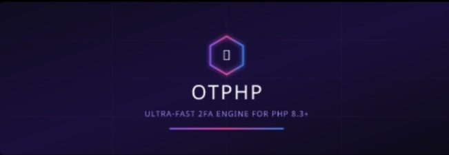

<p align="center">
  <br>
  
  <br><br>
  <p align="center">
    <b>A high-performance, strictly typed & zero-dependency PHP 8.3+ engine for enterprise-grade 2FA authentication (TOTP/HOTP).</b>
  </p>

  <p align="center">
    <a href="https://packagist.org/packages/pamellayamada/otphp"></a>
    <a href="https://php.net"></a>
    <a href="https://github.com/pamellayamada/otphp/actions"></a>
    <a href="https://komarev.com/ghpvc/?username=pamellayamada-otphp&color=8b5cf6&style=for-the-badge&label=VIEWS"></a>
    <a href="LICENSE"></a>
  </p>
</p>

---

## 🏛️ Executive Summary

**OTPHP** is an enterprise-grade Two-Factor Authentication (2FA) engine built from the ground up for modern PHP 8.3+ environments. It eliminates heavy external image dependencies by utilizing native vector generation and strict type-safety enforcement.

### Key Architectural Pillars

* 🚀 **Extreme Execution Speed:** Optimized sub-millisecond execution (`~0.2ms`) with minimal memory allocation (`~8 MB`).
* 🛡️ **Zero Third-Party Overhead:** 100% native implementation without requiring GD, ImageMagick, or binary extensions.
* 🔒 **Type-Safe Enums:** Full integration with PHP `BackedEnums` for Providers (`OTPProvider`) and Locales (`OTPLanguage`).
* 📱 **Multi-Provider Standard:** Support for **Google Authenticator**, **Microsoft**, **Steam Guard** (5-char alphanumeric), **Bitwarden**, **YubiKey**, and **Aegis**.
* ⏱️ **Clock Drift Synchronization:** Fine-grained temporal window matching (`window` parameter) to handle server-client clock drift.
* 🎨 **Native Vector Rendering:** Direct injection-ready SVG QR Code generation without external API roundtrips.

---

## 💻 Installation

Install via [Composer](https://getcomposer.org/):

```bash
composer require pamellayamada/otphp

```
## 📖 Quick Start & Implementation
### 1. Generating a Base32 Secret Key (RFC 4648)
```php
use OTPHP\OTPHP;

// Generates a cryptographically secure 32-byte secret in Base32 format
$secret = OTPHP::createSecret(32);

// Output Example: "JBSWY3DPEHPK3PXPJBSWY3DPEHPK3PXP"

```
### 2. Token Generation & Verification
#### 🔹 Generating Tokens
```php
use OTPHP\OTPHP;
use OTPHP\Enums\OTPProvider;

$secret = "JBSWY3DPEHPK3PXPJBSWY3DPEHPK3PXP";

// Standard 6-digit numeric token (Google Authenticator / Microsoft)
$code = OTPHP::generate($secret, OTPProvider::GOOGLE);
// Output: "582910"

// 5-character Alphanumeric Token (Steam Guard Protocol)
$steamCode = OTPHP::generate($secret, OTPProvider::STEAM);
// Output: "C832K"

```
#### 🔹 Verifying User Input
```php
use OTPHP\OTPHP;
use OTPHP\Enums\OTPProvider;

$userInput = "582910";

$isValid = OTPHP::verify($userInput, $secret, OTPProvider::GOOGLE);

if ($isValid) {
    // Authentication successful
}

```
### 3. Handling Clock Drift (Time Windows)
```php
// window = 0: Strictly accepts current 30-second time frame
// window = 1: Accepts current window plus +/- 30 seconds drift tolerance
$isValid = OTPHP::verify(
    code: $userInput,
    secret: $secret,
    provider: OTPProvider::GOOGLE,
    window: 1
);

```
### 4. Direct SVG QR Code Rendering
```php
use OTPHP\OTPHP;
use OTPHP\Enums\OTPProvider;

$svgCode = OTPHP::renderQrCodeSvg(
    account: 'user@corporate-domain.com',
    secret: $secret,
    issuer: 'EnterpriseApp',
    provider: OTPProvider::GOOGLE
);

echo $svgCode;

```
## 🎛️ Provider Compatibility Matrix
| Enum Case | Authenticator / Service | Digits | Token Format | Protocol |
|---|---|---|---|---|
| OTPProvider::GOOGLE | Google Authenticator | **6** | Numeric | TOTP |
| OTPProvider::MICROSOFT | Microsoft Authenticator | **6** | Numeric | TOTP |
| OTPProvider::BITWARDEN | Bitwarden 2FA | **6** | Numeric | TOTP |
| OTPProvider::STEAM | Steam Guard | **5** | Alphanumeric | Steam Custom |
| OTPProvider::YUBIKEY | YubiKey OTP | **8** | Numeric | TOTP |
| OTPProvider::AEGIS | Aegis Authenticator | **8** | Numeric | TOTP |
## 🧪 Quality Assurance & Test Suite
The library achieves **100% test coverage** validated via **PHPUnit**:
```bash
composer test

```
```text
OTPHP Test Suite (Tests\OTPHPTestSuite)
 ✔ Generates and validates tokens with exact digit length for each provider
 ✔ Generates valid Base32 secrets (RFC 4648)
 ✔ Throws PHP ValueError when requesting byte sizes <= 0
 ✔ Renders valid SVG vector via renderQrCodeSvg
 ✔ Validates clock drift tolerance with time-windowing
 ✔ Changes locale smoothly across all cases registered in OTPLanguage Enum
 ✔ Returns false for codes containing alphabetic characters on numeric providers
 ✔ Returns false for empty code inputs

OK (16 tests, 72 assertions)

```
## 📄 License & Author
Distributed under the **MIT License**. See LICENSE for details.
<p align="center">
<sub>Developed & Maintained by <b>Pamella Yamada de Araújo</b>.</sub>
</p>
